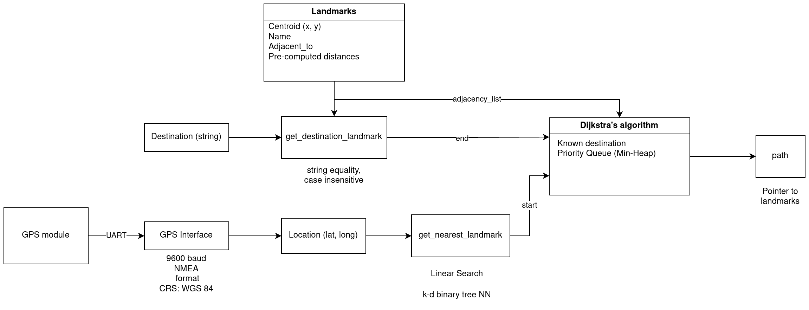
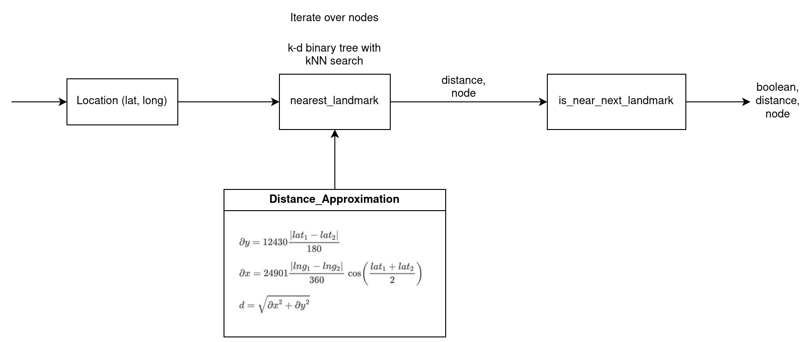

# ABOUT
This is the stm32 C project Code for the navigation subsystem.
Justin Lee

Purpose:
Read NMEA messages and parse them from an external GPS device over UART protocal.
Then, using a map stored on the stm32 of the Academic Campus of Purdue Lafayette, finds a path from the current
location to a destination location. Path generated is using "landmark" navigation.

### Activity Diagram

### Notes

Development environment used: stm32CubeIDE with stlink

External libraries used:
    HAL
    lwpgs: https://github.com/MaJerle/lwgps 

